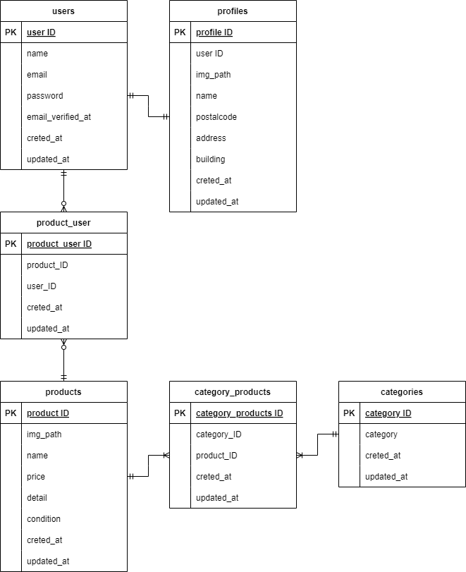

# coachtechフリマ
  
トップページ

## 背景・目的
* アイテムの出品と購入を行うためのフリマアプリを開発
* （模擬案件②を通して実践に近い開発経験を積み、定義された要件を実装する能力を身につける）

## アプリケーションURL
* 商品一覧画面（トップ画面）:http://localhost/
* 商品一覧画面（トップ画面）マイリスト:http://localhost/?page=mylist
* 会員登録画面:http://localhost/register
* ログイン画面:http://localhost/login
* 商品詳細画面:http://localhost/item/:item_id
* 商品購入画面:http://localhost/purchase/:item_id
* 送付先住所変更画面:http://localhost/purchase/address/:item_id
* 商品出品画面:http://localhost/sell
* プロフィール画面:http://localhost/mypage
* プロフィール編集画面:http://localhost/mypage/profile
* プロフィール画面 購入した商品一覧:http://localhost/mypage?page=buy
* プロフィール画面 出品した商品一覧:http://localhost/mypage?page=sell
* phpMyAdmin:http://localhost:8080/
* MailHog:http://localhost:8025/

## Gitリポジトリ
* https://github.com/gh-sugiura/mock_project2.git

## アプリケーション機能
* 会員登録
* 会員登録時のメール認証
* 会員のログインとログアウト
* 
* 打刻による会員ごとの勤務時間管理（休憩時間も考慮可能）

## 使用技術
* laravel 8.83.8
* PHP 7.4.9
* MySQL 8.0.26
* nginx 1.21.1
* phpMyadmin
* diagrams.net

## ER図

## 環境構築
**Dockerビルド**
1. `git clone git@github.com:coachtech-material/laravel-docker-template.git`
2. Gitリモートリポジトリ作成
3. GitリモートリポジトリとGitローカルリポジトリの紐付け
4. `docker-compose up -d --build`

**Laravel環境構築**
1. `docker-compose exec php bash`:PHPコンテナにログイン
2. `composer install`:composerのインストール
3. .env.exampleファイルから.envファイルを作成し、環境変数を設定
4. `php artisan key:generate`:アプリケーションキーの生成
5. `php artisan migrate`:マイグレーションの実行
6. `php artisan db:seed`:シーディングの実行

&ensp;※`sudo chmod -R 777 *`:ファイルアクセス権限を付与

## ユーザー情報
シーダーファイルにより生成されるユーザー情報は、以下の表の通りである。
| ユーザーID | ユーザー名  | メールアドレス         | ログインパスワード   | 出品した商品ID  | 出品した商品     | 
| :--------: | ---------- | --------------------- | ------------------ | :------------: | ---------------- | 
| 1          | sugiura    | sugiura@example.com   | sugisugi           | 1              | 腕時計           | 
| 2          | sato       | sato@example.com      | satosato           | 2              | HDD              | 
| 3          | tanaka     | tanaka@example.com    | tanatana           | 3              | 玉ねぎ3束        | 
| 4          | suzuki     | suzuki@example.com    | suzusuzu           | 4              | 革靴             | 
| 5          | ito        | ito@example.com       | itooitoo           | 5              | ノートPC         | 
| 6          | takahashi  | takahashi@example.com | takataka           |                | 　　　           | 
| 7          | watanabe   | watanabe@example.com  | watawata           |                | 　　　　　　　　　 | 
| 8          | yamamoto   | yamamoto@example.com  | yamayama           |                | 　　　　　      | 
| 9          | nakamura   | nakamura@example.com  | nakanaka           |                | 　　　　　　     | 
| 10         | kobayashi  | kobayashi@example.com | kobakoba           |                | 　　　　　　     | 